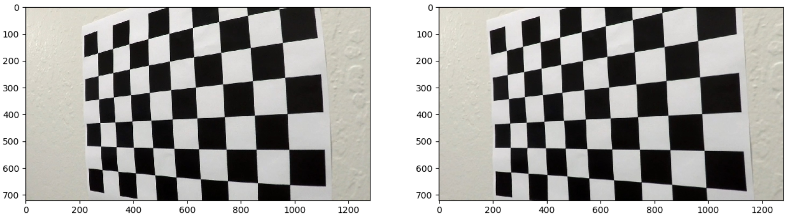

## Advanced Lane Finding

In this project, your goal is to write a software pipeline to identify the lane boundaries in a video, but the main output or product we want you to create is a detailed writeup of the project.  Check out the [writeup template](https://github.com/udacity/CarND-Advanced-Lane-Lines/blob/master/writeup_template.md) for this project and use it as a starting point for creating your own writeup.  

Creating a great writeup:
---
A great writeup should include the rubric points as well as your description of how you addressed each point.  You should include a detailed description of the code used in each step (with line-number references and code snippets where necessary), and links to other supporting documents or external references.  You should include images in your writeup to demonstrate how your code works with examples.  

All that said, please be concise!  We're not looking for you to write a book here, just a brief description of how you passed each rubric point, and references to the relevant code :). 

You're not required to use markdown for your writeup.  If you use another method please just submit a pdf of your writeup.

The Project
---

The goals / steps of this project are the following:

* Compute the camera calibration matrix and distortion coefficients given a set of chessboard images.
* Apply a distortion correction to raw images.
* Use color transforms, gradients, etc., to create a thresholded binary image.
* Apply a perspective transform to rectify binary image ("birds-eye view").
* Detect lane pixels and fit to find the lane boundary.
* Determine the curvature of the lane and vehicle position with respect to center.
* Warp the detected lane boundaries back onto the original image.
* Output visual display of the lane boundaries and numerical estimation of lane curvature and vehicle position.

The images for camera calibration are stored in the folder called `camera_cal`.  The images in `test_images` are for testing your pipeline on single frames.  If you want to extract more test images from the videos, you can simply use an image writing method like `cv2.imwrite()`, i.e., you can read the video in frame by frame as usual, and for frames you want to save for later you can write to an image file.  

To help the reviewer examine your work, please save examples of the output from each stage of your pipeline in the folder called `output_images`, and include a description in your writeup for the project of what each image shows.    The video called `project_video.mp4` is the video your pipeline should work well on.  

The `challenge_video.mp4` video is an extra (and optional) challenge for you if you want to test your pipeline under somewhat trickier conditions.  The `harder_challenge.mp4` video is another optional challenge and is brutal!

If you're feeling ambitious (again, totally optional though), don't stop there!  We encourage you to go out and take video of your own, calibrate your camera and show us how you would implement this project from scratch!

## Rubric Report

1.  Have the camera matrix and distortion coefficients been computed correctly and checked on one of the calibration images as a test?
    * Function camera_calibration(path, rows, columns) in process_utils.py
    
    (1) Followed the instructions in the classroom, use detected corner points of checkerboard image in the world coordinates and corresponding virtual object points at the image coordinate to calculate the calibration matrix using cv function.
    
    (2) Yes, as followed:
    
    
    
2. Has the distortion correction been correctly applied to each image?
    
    Yes, use calculated coefficients to undistort every image, one example as followed:
    
    
    
3. Has a binary image been created using color transforms, gradients or other methods?
    * Function binary_thresholding(undist, s_threshold, lx_threshold) in process_utils.py
    
    Yes, by using s channel thresholding + sobel x on l channel thresholding + vertices mask, the region of interest is highlighted, one example as followed:
    
    
    
4. Has a perspective transform been applied to rectify the image?
    
    Yes, by choosing the four points [0, 719], [598, 440], [682, 440], [1279, 719] carefully, the perspective transform is perform, one example as followed:
    
    
    
5. Have lane line pixels been identified in the rectified image and fit with a polynomial?
    * Function new_line_search(warped_img) and line_search(warped_img, line.current_left, line.current_right) in process_utils.py
    
    Yes, using sliding window search and polyfit, the pixels are selected and fit with a polynomial，one example as followed:
    
    
    
6. Having identified the lane lines, has the radius of curvature of the road been estimated? And the position of the vehicle with respect to center in the lane?
    * Function measure_curvature_real(img.shape[0], left_fit, right_fit) and measure_center_diviation(img.shape[1], img.shape[0], left_fit, right_fit) in process_utils.py
   
    Yes, one example as followed:
    
    

7. Does the pipeline established with the test images work to process the video?
    
    Yes, please refer to the generated video [project_video_test.mps](https://github.com/Haoyu-R/CarND-Advanced-Lane-Lines/blob/master/challenge_video_test.mp4) in main folder. (Note that the pipeline fails on challenge and harder_challenge video)
    
8. Discussion
    
    * The pipeline fails on the challenge videos means that more robust filter algorithm are needed, for example, based different color. Also, the perspective matrix should be calculated on every frame not using some default points
    * The curve should be considered using more advanced method
    * Other information like map can be integrated into lane detection

         

